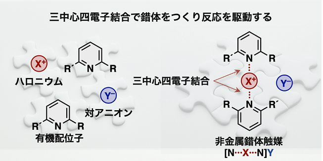

### About

本研究では、一価ハロゲンであるハロニウムに対して有機配位子と対アニオンを組み合わせた非金属錯体触媒を開発しました。開発した触媒は非常に高い触媒活性を示し、また、分光学的手法や計算科学の力を借りることで、触媒サイクルにおいてハロニウムの特異な性質が重要であることを見出しました。

### Link

- DOI: <10.1016/j.isci.2022.105220>
- <https://www.chem-station.com/blog/2022/11/mmtr.html>

---
