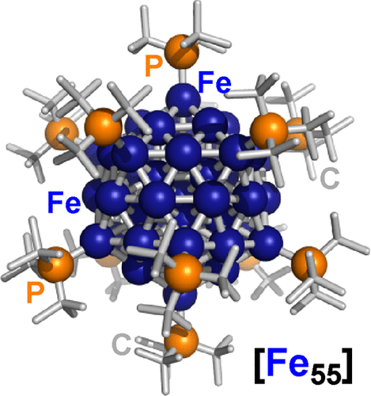

---
title: "Fe55クラスター"
date: 2026-05-17T12:00:00+09:00
description: "サイトが空のときのサンプル記事です。"
tags:
  - nanocluster
  - iron
  - hydride
draft: false
---

### About

55個の鉄原子をナノメートルサイズ（1.2ナノメートル径）の正二十面体型に配列し、表面を多数の水素原子（ヒドリド）が架橋した分子を、世界で初めて合成しました。

　ナノサイズの鉄クラスター錯体は、多くの合成化学者が挑戦を続けつつも未達であった「夢の化合物」であり、その詳細な性質は長年謎に包まれてきました。本研究の結果は、ナノメートル領域における鉄の反応性や性質を明らかにし、既存の物質化学・材料化学を凌駕するための第一歩に位置づけられます。例えば、複数の水素原子（ヒドリド）で架橋された鉄原子を用いる反応は、窒素分子を還元する自然界の酵素反応と工業的なハーバー・ボッシュ法に共通する特徴であり、これらの共通項を分子として具現化した鉄クラスター錯体は、従来は困難であった物質変換を可能にする、次世代の触媒になる可能性があります。

### Link

- An Icosahedral 55-Atom Iron Hydride Cluster Protected by Tri-tert-butylphosphines
- <https://pubs.acs.org/doi/10.1021/jacs.4c12759>
- <https://www.kyoto-u.ac.jp/ja/research-news/2025-01-21>

---
